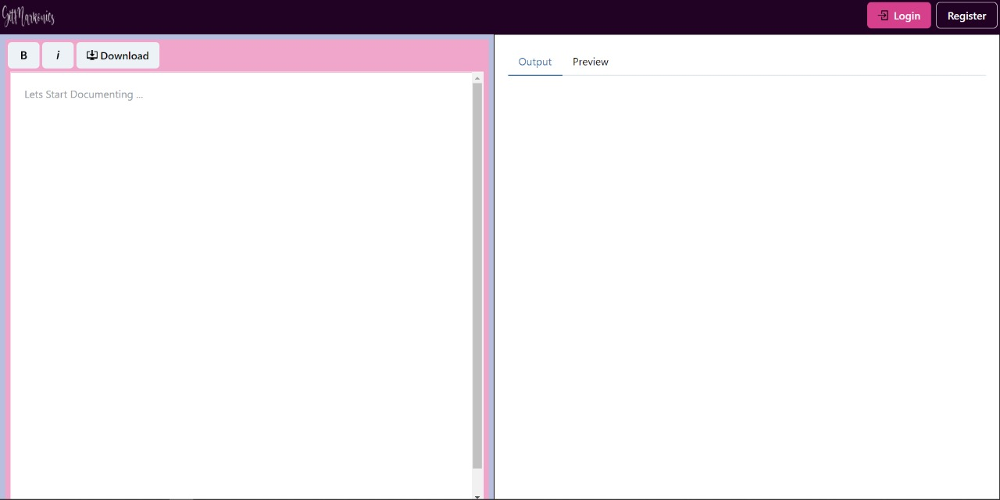

# WYSIWYG-Markdown

This Project is Developed to create Beautiful Documentation of your Projects by Providing you with a Readme.md File editor and Downloader.

DESIGN IN ISSUES !!..




## Prerequisites for Environment Setup

* [Download and Install Nodejs](https://nodejs.org/en/download/)

* Open terminal, write the following command and press enter.
```
$ npm -v
```
Terminal should return your npm version.

* [Download and install git](https://git-scm.com/downloads)

## Environment Setup for GitMarkonics

  #### 1. Clone App
  
  * Make a new folder and open the terminal there.
  * Write the following command and press enter.
  
  ```
    $ git clone https://github.com/CodeFlow201/GitMarkonics.git
  ```
    
 #### 2. Install node packages
 
  * Move inside the cloned folder with name GitMarkonics.
  * Write the following command and press enter to download all required node modules.
 
   ```
   $ npm install 
  ```
  
#### 3. Run Locally

 * While you are still inside the cloned folder, write the following command to run the website locally. 
 
 ```
   $ npm run start
 ```
  
 ###### NOTE: The port by default will be ```http://localhost:3000/```
  
## Want to Contribute?

To start contributing, follow the below guidelines: 

**1.**  Fork [this](https://github.com/CodeFlow201/GitMarkonics.git) repository.

**2.**  Follow the Environment setup above.

**3.** Checkout into a new branch 

     $ git checkout -b <branch_name>

**4.** Make your changes to it

**5.** Add and commit your changes

     $ git add . && git commit -m "<your_message>"
     
**6.** Push Code to Github under your branch 

     $ git push origin <branch_name>   

## How to Update Your Github Forked Repository

**1.** Lists the remote connections

    $ git remote -v

**2.** Adding the remote reporitory 
    
    $ git remote add upstream https://github.com/CodeFlow201/GitMarkonics.git

**3.** Fetching The Upstream Repository

    $ git fetch upstream

**4.** Finally Merging with Upstream Repository

    $ git merge upstream/master

# GitMarkonics:- WYSIWYG-Markdown-editor
This project is focused on solution to maintain large documentation of their project without a need to look for markdown file previewer and garbage commits at Github.

## Contributors
<table>
  <tr>
    <td>
      <a href="https://github.com/CodeFlow201/GitMarkonics/graphs/contributors">
        
      </a>
     </td>
  </tr>
</table>


